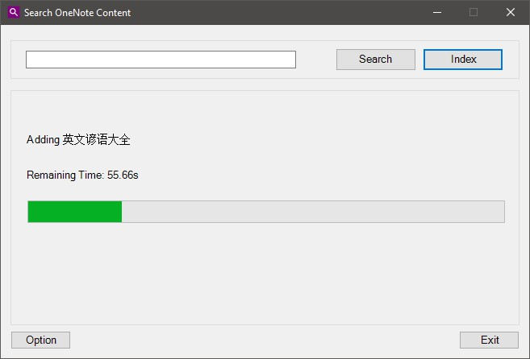
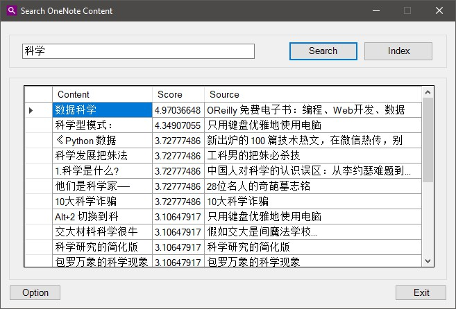
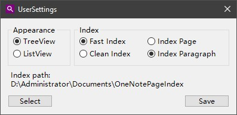

# Introduction
Enchance OneNote Search Functionality with Lucene.Net.  
This application aims to reimplement all functionallity of [OneNote Search Bar](https://www.onenotegem.com/onenote-search-bar.html)  

# Prerequisite
Lucene.Net 4.8.0  
Lucene.Net.Queries  
Lucene.Net.Analysis.Common  
Lucene.Net.Analysis.SmartCn  
Lucene.Net.QueryParser  
SharpZipLib  
HtmlAgilityPack  
System.ValueTuple
Visual Studio 2019  

# Manual
## Installation
Please download latest release file and unzip it. Then click `setup.exe` to install.
## Index
You can find this application in Start menu. Click to launch. You will see a simple user interface.
Click `Index` button and wait, it will index all page content for you.

## Search
After finish indexing, type anything you want in search box and click `Search` button. It will accept your query and return relevant paragraph.

  
You can navigate to page where the paragraph from, just double click the row. The target page will display in OneNote.

## Options
You can change your search result appearance, index cache path, index mode in this page.  
  

# Roadmap
- [x] Search and List Pages: Search pages in OneNote, and list pages.
- [x] Search and List Paragraphs: Search and list paragraphs and highlight the keyword.
- [ ] Search and List Paragraphs with Tag Icons: If search result is a tag paragraph, "Search Bar" list this paragraph with its tag icon.
- [ ] Search and List Paragraphs with Heading Icons: If search result is a heading paragraph, "Search Bar" list this paragraph with heading icon ( 1 - 6 ).
- [x] Search and List Image OCR Text
- [ ] List all Unindexed Pages: List all the unindexed pages in OneNote notebooks.
